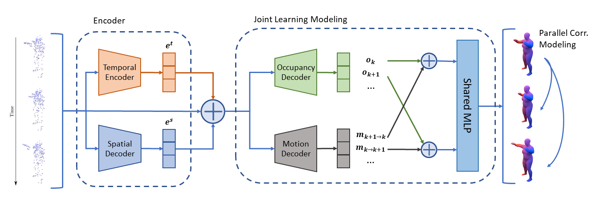

# ECCV 2022 - 4D Reconstruction demo
This is the webpage for ECCV 2022 submission

A demo web application of the 4D Reconstruction model.
Apart from the direct reconstruction, the web demo offers downloading of the reconstructed objects mesh as well.

## Data
We provided a sample data in sample folder which is randomly selected from the [Dynamic FAUST (D-FAUST)](http://dfaust.is.tue.mpg.de/) dataset. 

## Screencast Video

